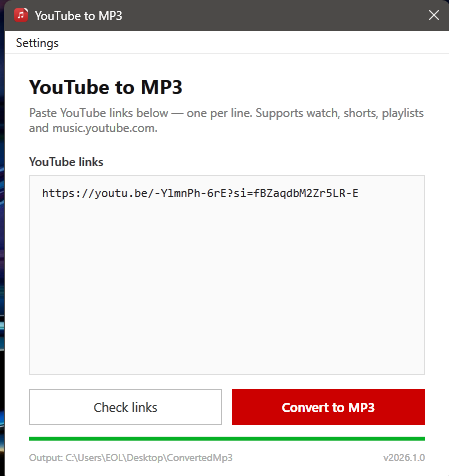

# 🎵 YouTube to MP3 Downloader

A modern Windows application built with **C# WinForms (.NET 8)** that converts YouTube videos into high-quality MP3 files.

Simply paste one or multiple YouTube links, validate them, and download audio with a single click.



---

## ✨ Features

- 🎵 Download YouTube videos as MP3
- 📋 Batch conversion (multiple URLs)
- ✅ Validate links before downloading
- 📁 Select a custom output folder
- 🖼️ Embed video thumbnails into MP3 files
- 📝 Embed artist, title, and metadata
- ⚡ Multiple concurrent downloads
- 🎧 High-quality MP3 output
- 🔗 Supports:
  - YouTube videos
  - YouTube Shorts
  - Playlists
  - YouTube Music
  - youtu.be short links

---

## 📥 Download

Download the latest release from the **Releases** page.

The application is distributed as a **single executable**, so no installation is required.

It already includes:

- .NET Runtime
- yt-dlp
- FFmpeg

On the first launch, the required binaries are automatically extracted.

---

## 🚀 Getting Started

1. Launch the application.
2. Paste one YouTube URL per line.
3. Click **Check Links**.
4. Click **Convert to MP3**.
5. Wait for the downloads to finish.

By default, files are saved to:

```
Desktop\ConvertedMp3
```

If a download fails, failed URLs are written to:

```
ConvertedMp3.Logs.txt
```

---

## ⚙️ Settings

Customize the application from the Settings menu.

Available options include:

- Change output folder
- Enable or disable thumbnail embedding
- Enable or disable metadata
- Configure concurrent downloads

---

## 🛠 Built With

- C#
- WinForms
- .NET 8
- yt-dlp
- FFmpeg

---

## 📦 Build From Source

### Requirements

- Windows
- .NET 8 SDK

Clone the repository:

```bash
git clone https://github.com/abubakkkar/YoutubeToMP3Downloader.git
```

Run the project:

```bash
dotnet run --project YoutubeToMP3/YoutubeToMP3.csproj
```

Publish a standalone executable:

```bash
dotnet publish YoutubeToMP3/YoutubeToMP3.csproj ^
-c Release ^
-r win-x64 ^
--self-contained ^
-p:PublishSingleFile=true ^
-p:EnableCompressionInSingleFile=true ^
-o ./publish
```

---

## ⚡ How It Works

The application uses **yt-dlp** together with **FFmpeg** to extract audio from YouTube videos.

Example command:

```bash
yt-dlp ^
-x ^
--audio-format mp3 ^
--audio-quality 0 ^
--embed-thumbnail ^
--embed-metadata ^
-o "ConvertedMp3/%(title)s.%(ext)s" ^
<YouTube URL>
```

---

## 🔄 Updating yt-dlp

If YouTube changes its platform and downloads stop working:

1. Download the latest **yt-dlp.exe**
2. Replace:

```
YoutubeToMP3/lib/yt-dlp.exe
```

3. Rebuild or publish the application.

---

## 📸 Screenshot


---

## ❤️ Support

If you find this project useful, consider giving it a ⭐ on GitHub.

Contributions, bug reports, and feature requests are always welcome.

---

## 📄 License

This project is released under the MIT License.

---

<div align="center">

Made with ❤️ by **ABUBAKAR**

</div>
